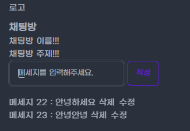

### Spring Legacy Community Project

---
#### Getting Started

설치 방법

1. Tomcat Download
   http://tomcat.apache.org/

2. Setting -> Plugins -> SmartTomcat Install

3. Edit Configuration -> add new Configuration -> smart tomcat
   Tomcat Server : 다운받은 톰캣 위치
   Deployment Dir.. : 자신 프로젝트의 src\webapp
   Context Path : /
4. Run 

---
#### Prject Structure

---
#### 구현 기능
- 게시글 
- 채팅방 (재귀적인 AJAX 호출을 이용한 채팅 글 최신화)
---
#### 결과물
- 게시글

- 채팅방 생성

- 채팅방 내용

